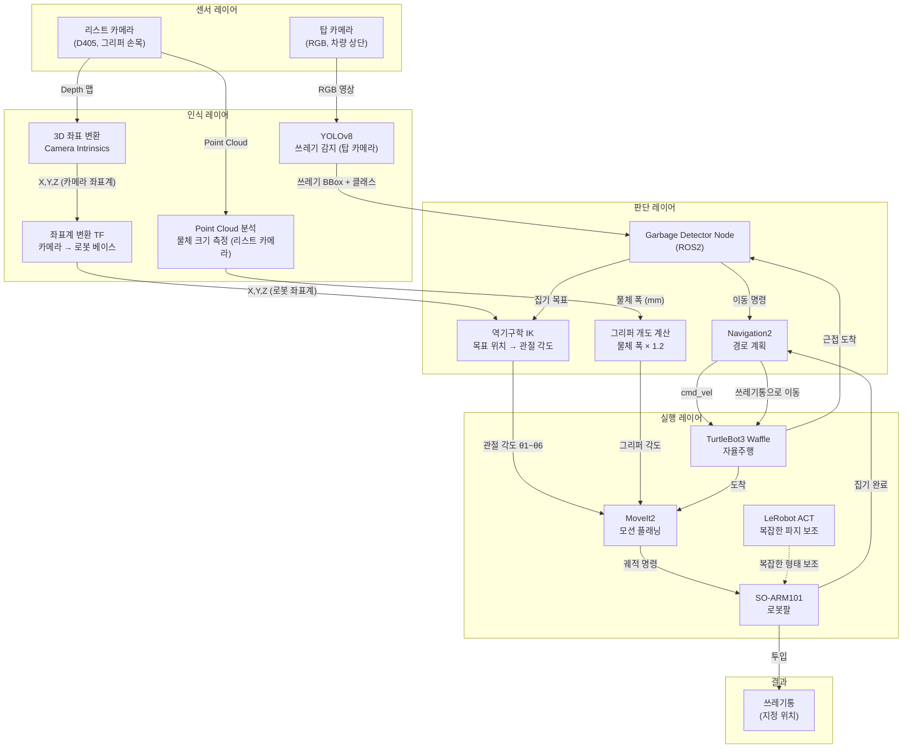
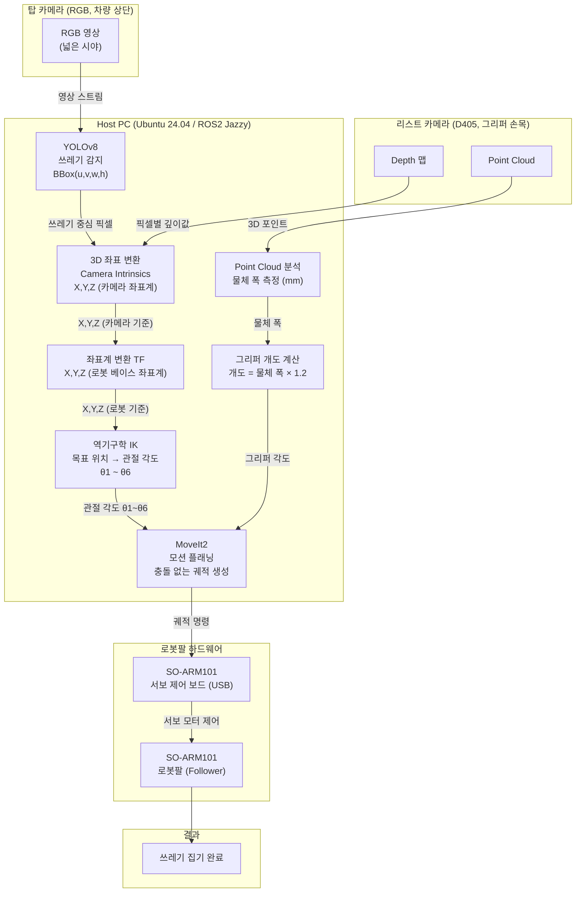
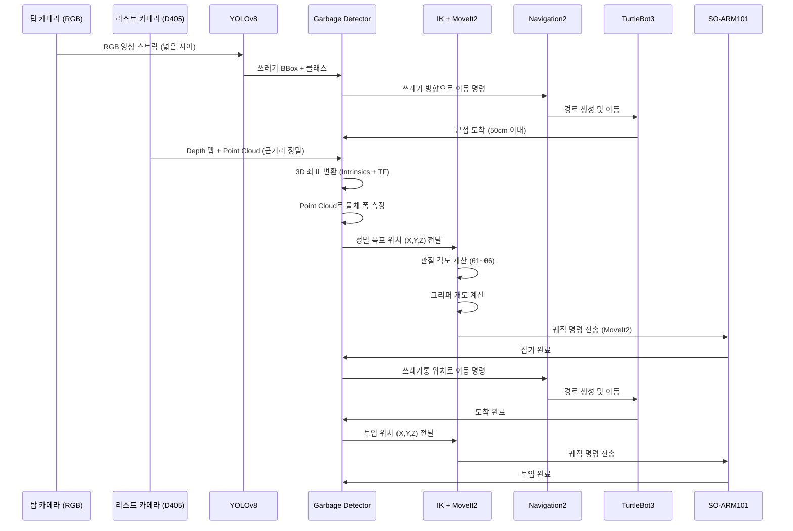
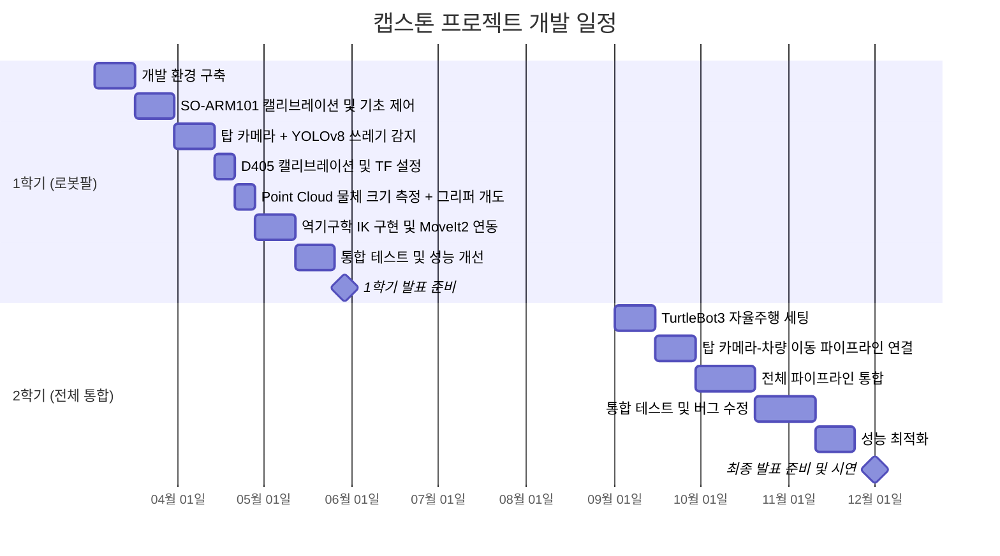

# SO-ARM101 자율 쓰레기 수거 로봇 캡스톤 프로젝트

> ROS2 + SO-ARM101 로봇팔을 활용한 자율 쓰레기 수거 시스템

---

## 개발 목적

현대 도시에서는 쓰레기 관리 문제가 계속 증가하고 있습니다. 특히 공원, 캠퍼스와 같은 넓은 공간에서는 사람이 직접 쓰레기를 찾고 수거하는 데 많은 시간과 인력이 필요합니다. 따라서 카메라와 인공지능을 이용해 쓰레기를 자동으로 탐지하고 로봇이 이동하여 수거하도록 하는 시스템을 만드는 것이 목적입니다.

---

## 카메라 구성

| 구분 | 종류 | 위치 | 역할 |
|------|------|------|------|
| 탑 카메라 | 일반 RGB 카메라 | 차량 상단 (고정) | 넓은 시야로 쓰레기 탐지 → 차량 이동 명령 |
| 리스트 카메라 | Intel RealSense D405 | 로봇팔 그리퍼 위 (손목) | 근접 후 정밀 3D 위치 및 물체 크기 측정 |

```
[탑 카메라 - RGB]          [리스트 카메라 - D405]
 차량 상단 고정                그리퍼 손목에 장착
 넓은 시야 (YOLOv8)           근거리 정밀 (7~50cm)
 쓰레기 감지 + 이동            3D 좌표 + 물체 크기
```

---

## 전체 시스템 블럭도 (2학기 최종)



---

## 1학기 블럭도



---

## 전체 동작 흐름



---

## 기술 스택

| 구분 | 기술 | 역할 |
|------|------|------|
| OS | Ubuntu 24.04 | 개발 환경 |
| 로봇 미들웨어 | ROS2 Jazzy | 노드 간 통신, TF 관리 |
| 자율주행 | TurtleBot3 Waffle + Navigation2 | 자율 이동 및 경로 계획 |
| 로봇팔 | SO-ARM101 (Follower) | 쓰레기 집기 실행 |
| 탑 카메라 | RGB USB 카메라 (차량 상단) | 넓은 시야로 쓰레기 탐지 |
| 리스트 카메라 | Intel RealSense D405 (그리퍼 손목) | 근거리 정밀 3D 측정 |
| 물체 인식 | YOLOv8 | 쓰레기 감지 및 BBox 추출 |
| 팔 제어 | MoveIt2 + 역기구학 (IK) | 위치 독립적 팔 모션 플래닝 |
| 보조 학습 | LeRobot ACT | 복잡한 형태 파지 보조 |
| 언어 | Python, C++ | - |

---

## 개발 로드맵

### 1학기 - 로봇팔 위주
- [ ] 개발 환경 구축 (ROS2 Jazzy + MoveIt2 + LeRobot)
- [ ] SO-ARM101 캘리브레이션 및 기초 제어
- [ ] 탑 카메라 + YOLOv8 쓰레기 감지
- [ ] D405 (리스트 카메라) 캘리브레이션 및 TF 설정
- [ ] Point Cloud로 물체 크기 측정 → 그리퍼 개도 계산
- [ ] 역기구학 (IK) 구현 및 MoveIt2 연동
- [ ] 통합 테스트 (감지 → IK → 집기 자율 동작)

### 2학기 - 전체 통합
- [ ] TurtleBot3 자율주행 연동
- [ ] 탑 카메라 → 차량 이동 파이프라인 연결
- [ ] 전체 파이프라인 통합 테스트
- [ ] 성능 최적화 및 시연

---

## 개발 일정



### 1학기 상세 일정

| 주차 | 기간 | 내용 | 목표 산출물 |
|------|------|------|------------|
| 1 ~ 2주 | 3월 1주 ~ 2주 | 개발 환경 구축 | Ubuntu 24.04 + ROS2 Jazzy + MoveIt2 + LeRobot 설치 완료 |
| 3 ~ 4주 | 3월 3주 ~ 4주 | SO-ARM101 기초 제어 | 캘리브레이션 완료, 텔레오퍼레이션 동작 확인 |
| 5 ~ 6주 | 4월 1주 ~ 2주 | 탑 카메라 + YOLOv8 | 쓰레기 감지 및 2D BBox 추출 |
| 7주 | 4월 3주 | D405 캘리브레이션 + TF 설정 | 리스트 카메라 ↔ 로봇 좌표계 변환 행렬 확보 |
| 8주 | 4월 4주 | Point Cloud 물체 크기 측정 | 물체 폭 측정 → 그리퍼 개도 자동 계산 |
| 9 ~ 10주 | 5월 1주 ~ 2주 | 역기구학 (IK) + MoveIt2 연동 | 목표 위치 → 관절 각도 계산 및 궤적 실행 |
| 11 ~ 13주 | 5월 3주 ~ 6월 1주 | 통합 테스트 | 감지 → IK → 집기 자율 동작 성공률 측정 |
| 14 ~ 15주 | 6월 2주 ~ 3주 | 성능 개선 | 파지 성공률 향상, 예외 케이스 처리 |
| 16주 | 6월 4주 | 1학기 발표 | 시연 영상 + 발표 자료 |

### 2학기 상세 일정

| 주차 | 기간 | 내용 | 목표 산출물 |
|------|------|------|------------|
| 1 ~ 2주 | 9월 1주 ~ 2주 | TurtleBot3 자율주행 세팅 | ROS2 + Navigation2 기본 주행 확인 |
| 3 ~ 4주 | 9월 3주 ~ 4주 | 탑 카메라 → 차량 이동 연결 | 탑 카메라 감지 → 목표 위치 이동 |
| 5 ~ 7주 | 10월 1주 ~ 3주 | 전체 파이프라인 통합 | 감지 → 이동 → 집기 → 투입 연결 |
| 8 ~ 10주 | 10월 4주 ~ 11월 2주 | 통합 테스트 및 버그 수정 | 엔드-투-엔드 동작 안정화 |
| 11 ~ 12주 | 11월 3주 ~ 4주 | 성능 최적화 | 수거 성공률 향상 |
| 13 ~ 16주 | 12월 | 최종 발표 준비 및 시연 | 최종 시연 영상 + 논문/보고서 |

---

## 개발 환경 세팅

### 사전 요구사항

- Ubuntu 24.04
- Python 3.10+
- GPU (CUDA 지원 권장)
- SO-ARM101 전체 키트 (Leader + Follower)
- Intel RealSense D405 (USB-C 3.1) - 리스트 카메라
- USB RGB 카메라 - 탑 카메라

---

### 하드웨어 스펙

#### Intel RealSense D405 (리스트 카메라)

| 항목 | 스펙 |
|------|------|
| 최적 측정 거리 | 7cm ~ 50cm |
| 최대 측정 거리 | ~1.5m |
| Depth 해상도 | 1280 × 720 @ 30fps |
| RGB 해상도 | 1280 × 800 @ 30fps |
| 셔터 방식 | 글로벌 셔터 |
| 인터페이스 | USB-C (USB 3.1) |
| 장착 위치 | SO-ARM101 그리퍼 손목 |

> D405는 근거리 특화입니다. 차량이 쓰레기에 근접(50cm 이내) 후 정밀 3D 측정에 활용합니다.

#### 탑 카메라 (RGB)

| 항목 | 스펙 |
|------|------|
| 종류 | USB RGB 카메라 |
| 역할 | YOLOv8 쓰레기 감지 |
| 장착 위치 | TurtleBot3 차량 상단 |

---

### 1. ROS2 Jazzy 설치

```bash
# UTF-8 로케일 설정
sudo apt update && sudo apt install -y locales
sudo locale-gen en_US en_US.UTF-8
sudo update-locale LC_ALL=en_US.UTF-8 LANG=en_US.UTF-8

# ROS2 저장소 등록
sudo apt install -y software-properties-common curl
sudo curl -sSL https://raw.githubusercontent.com/ros/rosdistro/master/ros.key \
    -o /usr/share/keyrings/ros-archive-keyring.gpg
echo "deb [arch=$(dpkg --print-architecture) signed-by=/usr/share/keyrings/ros-archive-keyring.gpg] \
http://packages.ros.org/ros2/ubuntu $(. /etc/os-release && echo $UBUNTU_CODENAME) main" \
    | sudo tee /etc/apt/sources.list.d/ros2.list

# ROS2 Jazzy 설치
sudo apt update
sudo apt install -y ros-jazzy-desktop

# 환경 설정
echo "source /opt/ros/jazzy/setup.bash" >> ~/.bashrc
source ~/.bashrc
```

---

### 2. MoveIt2 설치

```bash
sudo apt install -y ros-jazzy-moveit
```

---

### 3. Intel RealSense SDK 설치 (librealsense2)

```bash
# 의존성 설치
sudo apt update && sudo apt install -y \
    libssl-dev libusb-1.0-0-dev libudev-dev \
    pkg-config libgtk-3-dev cmake

# Intel 공식 저장소 등록
sudo mkdir -p /etc/apt/keyrings
curl -sSf https://librealsense.intel.com/Debian/librealsense.pgp \
    | sudo tee /etc/apt/keyrings/librealsense.pgp > /dev/null

echo "deb [signed-by=/etc/apt/keyrings/librealsense.pgp] \
https://librealsense.intel.com/Debian/apt-repo $(lsb_release -cs) main" \
    | sudo tee /etc/apt/sources.list.d/librealsense.list

sudo apt update
sudo apt install -y librealsense2-dkms librealsense2-utils librealsense2-dev
```

#### 설치 확인

```bash
# D405 연결 후
realsense-viewer
```

---

### 4. RealSense ROS2 래퍼 설치

```bash
sudo apt install -y ros-jazzy-realsense2-camera
```

#### D405 ROS2 노드 실행

```bash
source /opt/ros/jazzy/setup.bash

ros2 launch realsense2_camera rs_launch.py \
    depth_module.profile:=1280x720x30 \
    rgb_camera.profile:=1280x800x30 \
    pointcloud.enable:=true \
    align_depth.enable:=true
```

#### 토픽 확인

```bash
ros2 topic list | grep camera
# /camera/camera/color/image_raw          ← RGB 영상
# /camera/camera/depth/image_rect_raw     ← Depth 맵
# /camera/camera/depth/color/points       ← Point Cloud
```

---

### 5. 탑 카메라 (USB RGB) ROS2 노드 실행

```bash
sudo apt install -y ros-jazzy-usb-cam

ros2 run usb_cam usb_cam_node_exe --ros-args \
    -p video_device:=/dev/video0 \
    -p image_width:=1280 \
    -p image_height:=720 \
    -p framerate:=30.0
```

#### 토픽 확인

```bash
ros2 topic list | grep image
# /image_raw    ← 탑 카메라 RGB 영상
```

---

### 6. Miniconda 설치

```bash
wget https://repo.anaconda.com/miniconda/Miniconda3-latest-Linux-x86_64.sh
bash Miniconda3-latest-Linux-x86_64.sh
source ~/.bashrc
```

---

### 7. LeRobot 설치

#### 가상환경 생성

```bash
conda create -y -n lerobot python=3.10
conda activate lerobot
```

#### LeRobot 소스 클론 및 설치

```bash
git clone https://github.com/huggingface/lerobot.git
cd lerobot
pip install -e ".[feetech]"
```

> `[feetech]` 옵션은 SO-ARM101에서 사용하는 Feetech 서보 모터 드라이버를 함께 설치합니다.

---

### 8. SO-ARM101 포트 권한 설정

```bash
# USB 포트 권한 부여
sudo usermod -aG dialout $USER

# 재로그인 후 포트 확인
ls /dev/ttyUSB*
```

---

### 9. SO-ARM101 캘리브레이션

```bash
conda activate lerobot

# Leader 팔 캘리브레이션
python lerobot/scripts/control_robot.py calibrate \
    --robot-path lerobot/configs/robot/so101_leader.yaml

# Follower 팔 캘리브레이션
python lerobot/scripts/control_robot.py calibrate \
    --robot-path lerobot/configs/robot/so101_follower.yaml
```

---

### 10. 텔레오퍼레이션 (동작 확인)

```bash
conda activate lerobot

python lerobot/scripts/control_robot.py teleoperate \
    --robot-path lerobot/configs/robot/so101.yaml
```

Leader 팔을 손으로 움직이면 Follower 팔이 따라 움직이면 정상입니다.
